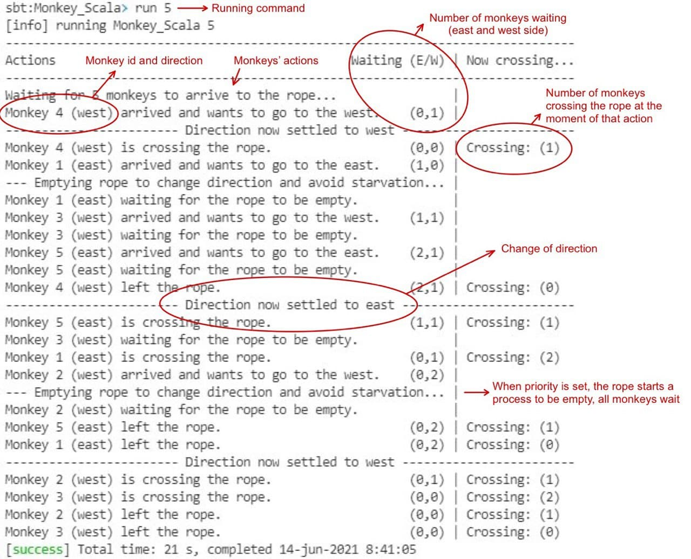
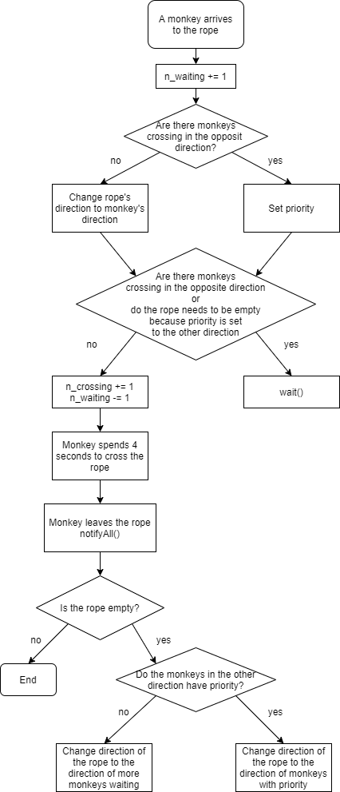

# Monkey problem in Scala

This code implements a solution for the Monkey Problem in Scala, which uses concurrency to let the instances of the class *Monkey* share one instance of the class *Rope* to cross a Canyon in two different directions.

## Problem description
We want to know if African monkeys can be taught about deadlocks. She locates a deep canyon and fastens a rope across it, so the monkeys can cross hand-over-hand. Passage along the rope follows these rules:
+ Several monkeys can cross at the same time, provided that they are all going in the same
direction.
+ If eastward moving and westward moving monkeys ever get onto the rope at the same time, a deadlock will result (the monkeys will get stuck in the middle) because it is impossible for one monkey to climb over another one while suspended over the canyon.
+ If a monkey wants to cross the canyon, he must check to see that no other monkey is currently crossing in the opposite direction.
+ Your solution should avoid starvation. When a monkey that wants to cross to the east arrives at the rope and finds monkeys crossing to the west, the monkey waits until the rope in empty, but no more westward moving monkeys are allowed to start until at least one monkey has crossed the other way.

For this exercise, you are to write a program to simulate activity for this canyon crossing problem:
+ Simulate each monkey as a separate process.
+ Altogether, a lot of monkeys, whatever you want, will cross the canyon, with a random number generator specifying whether they are eastward moving or westward moving.
+ Use a random number generator, so the time between monkey arrivals is between 1 and 8 seconds.
+ Each monkey takes 1 second to get on the rope. (That is, the minimum inter-monkey spacing is 1 second.)
+ All monkeys travel at the same speed. Each traversal takes exactly 4 seconds, after the monkey is on the rope.

## Files description
This repository contains the following Scala classes:
+ Main.scala: Main function that creates the rope and the monkeys that will cross the canyon as Threads.
+ Rope.scala: Rope class contains the methods to cross the rope, and implements the conditions to handle concurrency.
+ Monkey.scala: Monkey class perform the different actions of crossing the rope, using the methods described on the class Rope.

## How to run the program
I used [sbt](https://www.scala-sbt.org/) to handle automatic dependency management, so in order to run the program you need to [install sbt](https://www.scala-sbt.org/1.x/docs/es/Setup.html).

### Run the program using sbt
In a console, you can run the program using the following commands.

First, start sbt in the project directory:
```
$ sbt
```

Second, write `run` and the number of monkeys that you want to cross the rope. It needs to be any integer, *but keep in mind that negative monkeys are 0 monkeys*.
```
sbt:Monkey_Scala> run 5
```

Then, a validation process log will appear on the standard output, where you can follow the process by knowing all parameters while the process is running. An example and description of the log is shown below:



To exit sbt, you can write:
```
sbt:Monkey_Scala> exit
```

## Flowchart
This diagram shows the flow of the program for a better understanding of how concurrency works in this solution without reading the code:


